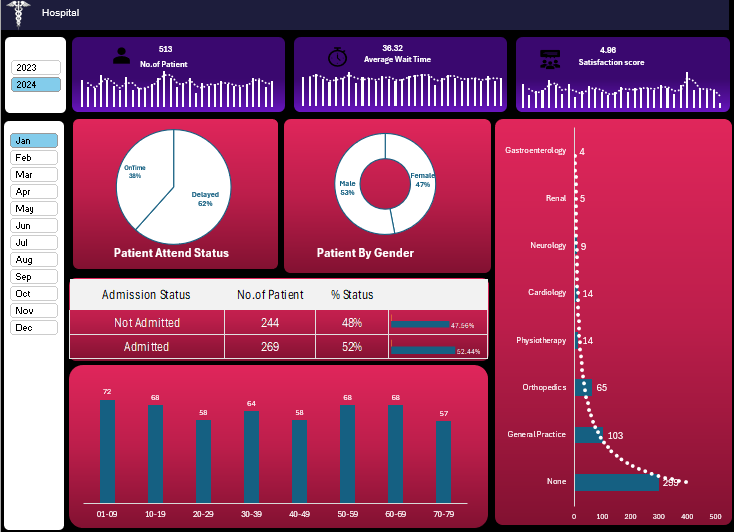

# 🏥 Hospital Emergency Analysis Dashboard  
---

## 📸 Dashboard Preview  
  

---
## 📌 Project Overview  
This project presents a **Hospital Emergency Analysis Dashboard** built in **Excel**. The dashboard is designed to help healthcare stakeholders **monitor, analyze, and make better decisions** in managing patients, improving operational efficiency, and enhancing overall service quality.  

The dashboard consolidates critical patient-related insights such as **patient volume, admission status, wait times, satisfaction scores, demographics, and department-wise distribution**, all in one interactive view.  

---

## 🎯 Objectives  
- Improve **hospital emergency efficiency** by providing real-time insights.  
- Enable **data-driven decision-making** for better patient management.  
- Track and analyze **key hospital performance metrics**.  
- Provide a **visual representation** of patient flow, demographics, and satisfaction.  

---

## 📊 Key Features & Insights  

1. **No. of Patients (513)** – Total patient count within the selected period.  
2. **Average Wait Time (36.32 mins)** – Helps monitor efficiency and reduce delays.  
3. **Satisfaction Score (4.98)** – Patient experience tracking.  
4. **Patient Attend Status** –  
   - On-time: 38%  
   - Delayed: 62%  
5. **Patient Demographics (Gender)** –  
   - Male: 53%  
   - Female: 47%  
6. **Admission Status** –  
   - Admitted: 52% (269 patients)  
   - Not Admitted: 48% (244 patients)  
7. **Age Group Distribution** – Insights into which age brackets require more attention (e.g., 10-19: 68, 50-59: 68).  
8. **Department-wise Analysis** – Patient distribution across hospital departments:  
   - General Practice: 103  
   - Orthopedics: 65  
   - Cardiology: 14  
   - Neurology: 9  
   - Gastroenterology: 4  
   - Others  

---

## 🛠️ Tools & Technology  
- **Microsoft Excel** – Dashboard creation, charts, pivot tables, and data visualization.  
- **Data Analysis** – Cleaned and structured patient records for meaningful insights.  

---

## 👤 Role as an Analyst  
As the analyst for this project, I was responsible for:  
- Gathering and cleaning raw hospital data.  
- Designing and building the **interactive Excel dashboard**.  
- Identifying **key KPIs** for hospital performance monitoring.  
- Providing **actionable insights** to improve patient service and reduce wait times.  

---

## 🚀 Benefits of This Dashboard  
✅ Quick access to **real-time patient insights**  
✅ Supports **better resource allocation** (beds, staff, and departments)  
✅ Identifies **bottlenecks in patient wait times**  
✅ Enhances **patient experience & satisfaction**  
✅ Helps in **strategic planning and service improvement**  

## 📂 How to Use  
1. Open the Excel file containing the dashboard.  
2. Use the **year & month filters** to analyze data for specific periods.  
3. Explore each visualization for insights into patient flow and hospital efficiency.  

---

## 📌 Future Improvements  
- Integration with **real-time hospital databases**.  
- Predictive analytics for patient inflow forecasting.  
- Automated reports and alerts for stakeholders.  

---

## 🏆 Conclusion  
This **Hospital Emergency Dashboard** provides an **all-in-one view** of hospital operations, enabling **stakeholders and management to make informed, data-driven decisions** to improve patient care and optimize resources.  
